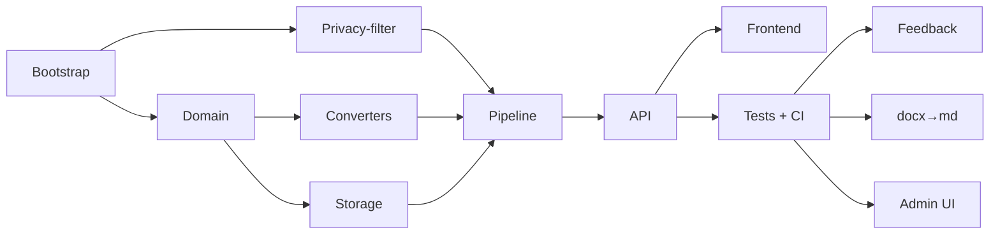

# Product Plan: neironir

> Status: Adopt-Phase в процессе
> Last Updated: 2025-01-15
> Reflects: текущее состояние проекта (фазы 0–5 завершены) + roadmap

## Принятые решения (adopt-фаза)

- **OD-001 ✅ Принято 2025-01-15:** Объём adopt — **только F09–F11** (post-MVP фичи). F00–F08 остаются в `docs/agents/`. Обоснование: post-MVP фичи имеют user-facing поведение, чёткий API, тесты; F00–F08 — фундамент, дублирование в SDD-формате не добавляет ценности.
- **OD-002 ✅ Принято 2025-01-15:** **Миграция.** `docs/agents/` остаётся в репозитории как **исторический/обзорный** артефакт (как дневник разработки), но **не обновляется**. Источник истины по требованиям и дизайну фич — `.ai/sdd/specs/`. `docs/architecture.md` и `docs/api.md` остаются каноническими для сквозной архитектуры и API-контракта. Синхронизация: при изменении `architecture.md`/`api.md` обновляются `design.md` соответствующих спеков.
- **OD-003 ✅ Принято 2025-01-15:** **Phase 3 не начинать.** Сначала стабилизация Phase 2 (FR-1, FR-2, FR-3): баг-фиксы, реверс-документация, регрессионные тесты. Новые фичи (PDF, in-process API) — не в плане до явного решения пользователя.

## Vision

`neironir` — локальный веб-сервис для удаления PII из `.md`/`.docx` документов перед загрузкой во внешние нейросети. Работает на машине пользователя через модель `openai/privacy-filter`. Преобразование однонаправленное: карта замен не хранится.

## Steering Context

- Product: @.ai/steering/product.md
- Tech Stack: @.ai/steering/tech-stack.md
- Conventions: @.ai/steering/conventions.md
- Principles: @.ai/steering/principles.md

## Personas

- **Автор документа** (юр/аналитик/журналист/разработчик): хочет безопасно отдать `.md`/`.docx` в LLM, не утекая PII.
- **Администратор системы**: управляет аннотациями, дообучает модель, утверждает правила.

## Текущее состояние (Phases 0–5 — завершены)

Согласно `docs/agents/` и `README.md`:

- **Phase 0 — bootstrap:** uv, pyproject, Makefile, .env.example, .gitignore, базовая структура.
- **Phase 1 — submodule & research:** `privacy-filter` как git submodule; `mock`-режим для CI; документ `privacy-filter-research.md`.
- **Phase 2 — domain & contracts:** `EntityType` (8 типов), `Job`/`JobStatus`, `PlaceholderCounter` (сквозная нумерация по документу), API-схемы.
- **Phase 3 — backend:** конвертеры `.md`/`.docx`, `LocalStorage`, `PrivacyFilterClient` (subprocess), `run_job()` pipeline, эндпоинты `/api/v1/documents/*`.
- **Phase 4 — frontend:** SPA (`index.html`/`app.js`/`styles.css`) — drop-zone, polling, download, review/feedback.
- **Phase 5 — tests & infra:** unit + integration (включая `real_model` тесты) + e2e, GitHub Actions (lint + type + test + coverage ≥ 70%), `make pre-release`.

## MVP Boundary (текущая итерация)

### Must Have (реализовано)

- Загрузка `.md`/`.docx` через UI.
- Очистка 8 типов PII → стабильные плейсхолдеры.
- Выдача файла того же формата.
- `mock` + `subprocess` режимы.
- BackgroundTasks, локальная FS, без auth.

### Should Have (реализовано)

- Применение пользовательских правок (feedback) к итоговому файлу — FR-1.
- Конвертация `.docx → .md` (Pandoc + fallback) — FR-2.
- Admin UI (счётчики, feedback, запуск `opf train`, утверждение правил) — FR-3.

### Won't Have Yet (явно вне scope)

- Авторизация и роли.
- Очереди (Celery/RQ) и горизонтальное масштабирование.
- Поддержка форматов кроме `.md`/`.docx`.
- Обратная замена (reverse map) — см. P-003.
- Структурное логирование, метрики, observability.
- Docker / production-обвязка.

## Feature Map

### Phase 1 — MVP (завершено, входит в adopt-документацию)

| ID  | Feature                          | Module / Path                                      | Description |
|-----|----------------------------------|----------------------------------------------------|-------------|
| F00 | Bootstrap                        | `pyproject.toml`, `Makefile`, `.env.example`       | uv, инструменты, базовая структура |
| F01 | Privacy-filter integration       | `privacy-filter/` (submodule), `backend/neironir/privacy/` | mock + subprocess |
| F02 | Domain & contracts               | `backend/neironir/domain/`                         | EntityType, Job, PlaceholderCounter |
| F03 | Converters (.md / .docx)         | `backend/neironir/converters/`                     | извлечение/сборка |
| F04 | Local storage                    | `backend/neironir/storage/local.py`                | FS-реализация |
| F05 | Pipeline worker                  | `backend/neironir/workers/pipeline.py`             | `run_job()` |
| F06 | API                              | `backend/neironir/api/`                            | `/api/v1/documents/*` |
| F07 | Frontend SPA                     | `frontend/`                                        | drop-zone, polling, download |
| F08 | Tests + CI + coverage gate       | `tests/`, `.github/workflows/`                     | unit + integration + e2e, ≥ 70% |

### Phase 2 — Essentials (Should Have, реализовано, входит в adopt)

| ID  | Feature                                   | Module / Path                                                  | Description |
|-----|-------------------------------------------|----------------------------------------------------------------|-------------|
| F09 | Apply feedback to result file             | `backend/neironir/workers/pipeline.py`, `api/jobs.py`, `frontend/app.js` | offsets → координаты очищенного файла; сохранение сквозной нумерации |
| F10 | .docx → .md conversion (Pandoc + fallback)| `backend/neironir/converters/docx.py`, API-флаг               | чекбокс в UI; Pandoc → fallback на python-docx |
| F11 | Admin UI                                  | `backend/neironir/api/admin.py`, `frontend/admin.html`         | счётчики, feedback, запуск `opf train`, статус, утверждение правил |

### Phase 3 — Nice to Have (Could Have, **не в текущем плане**)

- PDF/RTF/изображения.
- In-process Python API для `opf` (вместо subprocess).
- Reverse map (конфликтует с P-003 — не делать).
- Расширенные типы PII (за рамками P-004 — нужно явное требование).
- OAuth / SSO.
- Очереди, брокеры, multi-worker.
- Структурное логирование, метрики (Prometheus), трейсинг.

## Adopt-Phase Plan (текущий шаг)

**Цель:** перевести уже реализованные фазы 2-фичи (FR-1, FR-2, FR-3) в SDD-артефакты как **реверс-документацию** — это не переписывание кода, а фиксация контракта.

### Шаги

1. **Подтверждение объёма** (с пользователем):
   - Переводить ли F00–F08 (MVP-фазу) в спеки? Или только F09–F11 (post-MVP)?
   - Рекомендация: начать с **трёх post-MVP фич** (F09, F10, F11) — у них уже есть user-facing поведение, чёткий API и тесты; MVP-фаза слишком фундаментальна для реверса (лучше оставить как есть в `docs/agents/`).
2. **Генерация артефактов** для одобренных фич:
   - `requirements.md` — извлечь user stories и acceptance из `docs/agents/03-backend.md`, `docs/api.md`, `TODO.md`, тестов.
   - `design.md` — извлечь решения из кода (`backend/neironir/`) + комментариев в `docs/agents/`.
   - `tasks.md` — восстановить таски по истории коммитов / TODO-элементам / структуре тестов.
   - `review.md` — прогнать `make test-cov` и `make test-real`, зафиксировать pass/fail.
3. **Статусы:** для каждой фичи `.status` → `tasks:approved` (т.к. код и тесты уже есть), затем `review:done` после прохождения `make pre-release`.

### Почему не полный реверс сразу

- F00–F08 — это **фундамент**: их требования и дизайн — это сама структура `docs/agents/00..05`. Перевод в SDD-формат — дублирование без выгоды.
- F09–F11 — это **продуктовые фичи** с user stories, API-эндпоинтами, UI-секциями, тестами. SDD-формат для них даёт ценность: лёгкий онбординг новых контрибьюторов, явные границы, готовность к изменениям.

## Dependencies

## Risks

| Risk                                                                  | Impact | Mitigation |
|-----------------------------------------------------------------------|--------|------------|
| Privacy-filter submodule устарел / модель изменила API                | High   | `make test-real` обязателен; pin на конкретный commit; CI не запускает real_model |
| `.docx`-конвертер теряет форматирование                               | Medium | Документировано (P-012); UX-warning в UI; future — pypandoc + pandoc-binary |
| Mock-режим расходится с реальной моделью                              | High   | `real_model` тесты; CI gate; принцип P-007/P-008 |
| Карта замен случайно попадает в лог/артефакт                          | Critical | Принцип P-003; код-ревью; грэп-чек в CI на отсутствие `mapping`/`replacements` в логах |
| SDD-adopt создаёт дублирование с `docs/agents/`                       | Low    | Adopt — только для post-MVP фич; MVP-фазы оставлены в `docs/agents/` |
| Pandoc недоступен на машине пользователя                              | Low    | Fallback на `python-docx` (плоский текст); documented |

## Open Decisions

_(Все OD на 2025-01-15 решены. См. секцию «Принятые решения» выше.)_

- **OD-004 ✅ Принято 2025-01-15:** Сценарий B (preview после apply). Фикс в фиче 001: локальный re-render `reviewData`. Закрыт.
- **OD-005 ✅ Принято 2025-01-15:** Стабилизация Phase 2 (OD-003) выполнена в спеке `004-stabilize-phase2`: mypy 0, ruff 0, format 0, pytest 357 passed / 0 failed, coverage 83%. Root-cause баг (admin middleware redirect loop) устранён.

## Статус стабилизации (2025-01-15)

- `make pre-release`-эквивалент: **зелёный** — ruff 0, format 0, mypy 0, pytest mock+e2e 376 passed / 0 failed, real_model 6/6 passed, playwright-e2e 19/19 passed, coverage 83%.
- Остаток: 2 осознанных скипа (docx_to_md стили). Релиз Phase 2 возможен.

## Next Step

Текущая активная задача (вне adopt-документации, экспресс-фикс):

- **Bug:** «правки не сохраняются после нажатия кнопки “Проверить анонимизацию”». Точный сценарий уточняется у пользователя (см. OD-004).
- После уточнения — `/skill:sdd-exec` для исправления + регрессионный тест.
- Параллельно — реверс-документация F09: `/skill:sdd-prd` → `sdd-spec` → `sdd-tasks` → `sdd-review` для `.ai/sdd/specs/001-apply-feedback-to-result/`.
