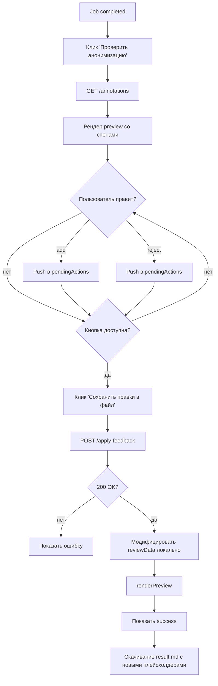

# Design: Apply Feedback to Result File (FR-1) — UI regression

> Requirements: @requirements.md
> Status: Approved

## 1. Summary

Два изменения в frontend:
1. **Удаление** трёх кнопок и связанных DOM-элементов + JS-обработчиков (D-001).
2. **Корректный re-render preview** после успешного `POST /apply-feedback` — preview отражает применённые правки (D-002).

Бэкенд не трогаем (D-003).

## 2. Requirements Mapping

| Requirement | Design Coverage                          |
|-------------|------------------------------------------|
| FR-001      | §3.1 Re-render preview from response     |
| FR-002      | §3.2 Disable button when no actions      |
| FR-003      | §3.3 Remove buttons + handlers           |
| FR-004      | §3.4 Update hint text                    |
| FR-005      | §3.5 Regression test                     |
| NFR-001     | §3.3 (только UI; API остаётся)           |
| NFR-002     | §3.6 a11y notes                          |
| NFR-003     | (N/A — privacy не затрагивается)         |

## 3. Technical Approach

### 3.1 Re-render preview from response

После успешного `applyFeedbackToFile` сервер возвращает `ApplyFeedbackResponse`:
```json
{
  "added": 2,
  "rejected": 1,
  "kept": 5,
  "training_records_added": 3
}
```

**Проблема:** ответ не содержит нового `reviewData` (бэкенд не меняем). Текущий код вызывает `GET /annotations` и получает **старые** данные (аннотации не обновляются apply'ом).

**Решение (минимальное, без бэкенда):** после успешного apply модифицируем локальный `reviewData`:
- Удалить из `reviewData.spans` те, по которым был `reject` (по `original_span_index`).
- **Заменить** в `reviewData.text` rejected-участки на исходный текст (`ann.text` из текущего `reviewData.spans[i]`).
- **Заменить** в `reviewData.text` add-участки на новый плейсхолдер, сгенерированный по правилам бэкенда (TYPE_N, где N = следующий свободный индекс для этого типа в документе). Это **копия** серверной логики нумерации — допустимо, потому что в `domain/placeholder.py` она уже есть на клиенте (см. `PlaceholderCounter`).
- Вызвать `renderPreview()` с обновлённым `reviewData`.

**Альтернатива (отвергнута):** перезагрузить `result.md` и перепарсить его клиентом. Сложно для `.docx` (preview показывает extracted text, не docx-структуру) и не нужно.

### 3.2 Disable button when no actions

`updateSubmitButton()` сейчас прячет `#submit-feedback` (его удалим). Добавим логику для `#apply-feedback`:
- Если `reviewData.spans` пустой и `pendingActions` пустой → `disabled = true` + tooltip «Нет правок для применения».
- Иначе → `disabled = false`.

Вызывать в тех же местах, где сейчас вызывается `updateSubmitButton()`: после `openReview`, после `addAction`, после `removeAction`, после успешного `applyFeedbackToFile`.

### 3.3 Remove buttons + handlers

**Удалить из `index.html`:**
- `<button id="confirm-all">` (строка 76)
- `<button id="apply-feedback" class="primary">` → оставить, **меняем текст** на «Сохранить правки в файл» (он уже такой).
- `<button id="submit-feedback">` (строка 77)
- `<button id="skip-review">` (строка 78)
- `<p id="feedback-success">` (строка 85)
- `<div id="comment-section">` (строки 80-83) — комментарий больше не нужен

Оставить только:
```html
<button type="button" id="apply-feedback" class="button primary">Сохранить правки в файл</button>
```

**Удалить из `app.js`:**
- `$ = document.getElementById("confirm-all")` и обработчик `confirmAll.addEventListener` (строки ~96, 99)
- `$ = document.getElementById("submit-feedback")` и `submitFeedback.addEventListener` (строки ~97, 100)
- `$ = document.getElementById("skip-review")` и `skipReview.addEventListener` (строки ~98, 101)
- Функции `confirmAll()` (656-674), `submitFeedback()` (676-722), `postFeedback()` (878-900) — проверено: `admin.js` **не использует** `postFeedback`, удаляем полностью.
- `updateSubmitButton()` — упростить до `updateApplyButton()`.
- В `openReview()`: убрать строки про `$.confirmAll.hidden = false; $.submitFeedback.hidden = true; $.commentSection.hidden = true; $.feedbackSuccess.hidden = true;`.
- В `closeReview()`: убрать аналогичные строки.

### 3.4 Update hint text

`<p class="hint">` (index.html:59) сейчас:
> «Выделите текст мышью, чтобы добавить пропущенную сущность. Нажмите на сущность, чтобы удалить ложное срабатывание.»

Новый текст:
> «Выделите текст мышью, чтобы добавить пропущенную сущность. Нажмите на сущность, чтобы удалить ложное срабатывание. Нажмите «Сохранить правки в файл», чтобы применить правки к итоговому документу.»

### 3.5 Regression test

**Файл:** `tests/unit/frontend/test_review_simplification.py` (новый) — статанализ `app.js` + `index.html`.

Тесты:
- `test_no_confirm_all_button` — `#confirm-all` нет в `index.html`.
- `test_no_submit_feedback_button` — `#submit-feedback` нет в `index.html`.
- `test_no_skip_review_button` — `#skip-review` нет в `index.html`.
- `test_no_feedback_success_message` — `#feedback-success` нет в `index.html`.
- `test_no_comment_section` — `#comment-section` нет в `index.html`.
- `test_apply_button_present` — `#apply-feedback` есть в `index.html`.
- `test_post_feedback_still_callable` — `postFeedback` либо удалена, либо остаётся (для админки). Если удалена — добавить комментарий «только админка» и проверить, что админский код не использует.
- `test_apply_feedback_updates_preview` — найти в `app.js` место после успешного `applyFeedbackToFile` и убедиться, что `renderPreview()` вызывается **с обновлённым** `reviewData` (не просто `GET /annotations`).

### 3.6 a11y

- `apply-success` уже имеет `aria-live` (проверить, добавить если нет).
- Focus после apply: либо на `apply-feedback` (остаётся disabled, focus теряется — нежелательно), либо на `preview`. Простой вариант: оставить focus на кнопке, снять `disabled` после re-render.

## 4. Component / Module Structure

```text
frontend/
  index.html                       (modify: remove buttons, update hint)
  app.js                           (modify: remove handlers, update apply flow)
tests/unit/frontend/
  test_review_simplification.py    (new)
```

## 5. Data Model / State

Не изменяется. `reviewData` и `pendingActions` остаются локальными переменными.

## 6. API / Integration Contract

**Не изменяется.** Используется существующий `POST /api/v1/documents/{id}/apply-feedback`.

## 7. Security / Permissions / Privacy

- N/A — privacy-инварианты не затрагиваются.
- P-003 не нарушается: forward-actions в `feedback.json` — это **не** reverse map (он бы позволял восстановить PII из плейсхолдера; forward actions — наоборот, про подтверждение/добавление замен).

## 8. User Flows



## 9. Edge Cases

| Case | Expected Behavior |
|------|-------------------|
| Нет правок вообще (пустой документ) | Кнопка disabled с tooltip «Нет правок для применения» |
| Server возвращает 200, но `added+rejected+kept = 0` | Показать success с нулями; preview без изменений (rare; возможно при idempotent apply) |
| Server возвращает 400 (например, `docx_output_not_supported`) | Показать `apply-error` с сообщением сервера |
| Server timeout / network error | Показать `apply-error` с текстом «Сеть: ...» (уже есть) |
| Пользователь кликает «Сохранить» дважды быстро | Кнопка `disabled = true` на время запроса (уже есть через `previousDisabled`) |

## 10. Accessibility / UX Notes

- `aria-live="polite"` на `apply-success`.
- Focus management: не терять focus при apply.
- Hint text обновлён — пользователь сразу понимает, что делает кнопка.

## 11. Observability / Operations

Не применимо (frontend-only, observability — вне MVP).

## 12. Migration / Rollout

- Изменения только в frontend.
- Никаких миграций данных, feature flag, rollout plan.
- После мержа — пользователи увидят изменения при следующей загрузке страницы.

## 13. Technical Decisions

### TD-001: Локальная модификация reviewData вместо повторного GET /annotations

- **Decision:** После apply модифицируем `reviewData` в JS на основе отправленных actions, затем `renderPreview()`.
- **Why:** GET /annotations возвращает старые данные (аннотации не обновляются apply'ом). Сервер не отдаёт новое состояние preview.
- **Trade-off:** Логика нумерации плейсхолдеров дублируется на клиенте (TYPE_N). Расхождение с сервером = расхождение preview с файлом. **Митигация:** тест, проверяющий, что `feedback_applier.py` и клиентская функция нумерации дают одинаковый результат.
- **Alternatives considered:** Перезагрузить `result.md` и перепарсить. Сложно; preview показывает extracted text, не docx.

### TD-002: Удалить `postFeedback` из JS

- **Decision:** Удалить функцию `postFeedback` полностью. `admin.js` использует свой `fetch` и не вызывает `postFeedback` (проверено grep'ом).
- **Why:** Мёртвый код после удаления `confirmAll`/`submitFeedback`. Оставлять = лишний риск случайного вызова.
- **Trade-off:** Нет.

## 14. Risks

| Risk | Impact | Mitigation |
|------|--------|------------|
| Клиентская нумерация плейсхолдеров расходится с серверной | High (preview ≠ file) | Регрессионный тест; взять `PlaceholderCounter` из `domain/` (если можно импортировать в JS) или 1-в-1 скопировать правило |
| Удаление кнопок ломает админский поток | Medium | Проверить `admin.js` перед удалением `postFeedback`; если использует — оставить |
| `aria-live` отсутствует | Low | Проверить и добавить |

## 15. Verification Strategy

- **Static (новые тесты):** `tests/unit/frontend/test_review_simplification.py`.
- **Manual:** загрузить `.md`, добавить правки, нажать «Сохранить правки в файл», убедиться, что preview обновился; скачать файл, открыть в редакторе — плейсхолдеры на месте.
- **Existing tests:** `make test` (mock) — не должно быть регрессий.

## 16. Implementation FAQ

**Q:** А что если пользователь хочет «просто подтвердить без правок» (сценарий исходной «Всё верно»)?  
**A:** Кнопка «Сохранить правки в файл» шлёт те же confirm-действия; пользователь жмёт её и получает success с `kept=N`. Поведение эквивалентно.

**Q:** Не сломается ли админка, если мы оставим `postFeedback` в JS?  
**A:** `admin.js` использует свой `fetch` (см. recon), не вызывает `postFeedback` из `app.js`. Проверим при exec.

**Q:** Как тестировать «preview обновился» без browser?  
**A:** Статанализ: проверить, что в `app.js` после успешного fetch есть вызов `renderPreview()` **после** модификации `reviewData`. Полноценный e2e — Playwright/Cypress (вне scope).
