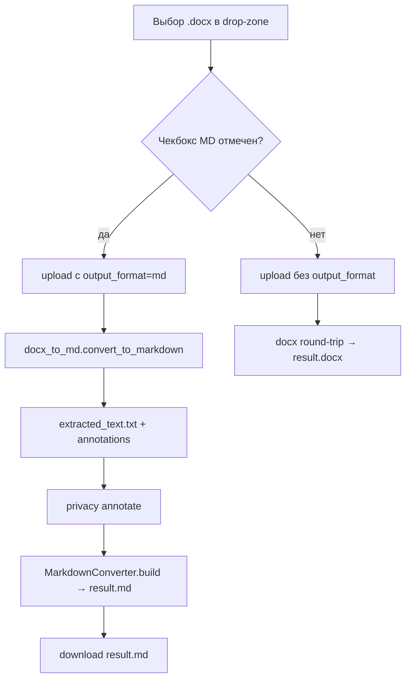

# Design: .docx → .md Conversion (F10)

> Requirements: @requirements.md
> Status: Approved

## 1. Summary

Конвертация `.docx → .md` реализована собственным конвертером `backend/neironir/converters/docx_to_md.py` (python-docx, без pandoc). Пайплайн для `docx+output_format=md`: извлекает markdown-текст → сохраняет `extracted_text.txt` → аннотирует → пишет `result.md` через `MarkdownConverter.build` над промежуточным `extracted.md`.

## 2. Requirements Mapping

| Requirement | Design Coverage |
|-------------|-----------------|
| FR-001 | §3.1 docx_to_md.py, §3.3 pipeline |
| FR-002 | §3.2 _validate_output_format |
| FR-003 | §3.2 default = source ext |
| FR-004 | §3.4 UI checkbox |
| FR-005 | §3.3 extracted.md + MarkdownConverter |
| FR-006 | §3.5 tests |
| NFR-001 | §3.3 (offset-модель) |
| NFR-002 | python-docx in-process |
| NFR-003 | extracted_text.txt в job-dir |

## 3. Technical Approach

### 3.1 Конвертер `converters/docx_to_md.py`

```text
convert_to_markdown(source: Path) -> str
  └─ extract_markdown_runs(source) -> Iterator[MarkdownElement]
       ├─ _paragraph_to_elements (heading/paragraph/blank)
       ├─ _table_to_element (pipe-table)
       └─ _resolve_table, _heading_level, _render_runs
```

- Заголовки: style name матчится (`Заголовок 1`, `Heading 1`, `1 уровень`, `2 уровень` …) → `#`, `##`, …; без текста — пропускается.
- Runs: `**bold**`, `*italic*`; underline/strike/custom → plain text; internal whitespace collapsed.
- Гиперссылки: `w:hyperlink` схлопываются в текст.
- Таблицы: pipe-table, первая строка — header, колонки padding; пустые таблицы пропускаются; таблицы интерливируются с параграфами в документном порядке.
- `extract_markdown_runs` — публичный API для тестов и возможного переиспользования.

### 3.2 API-валидация (`api/jobs.py`)

- `output_format: str | None = Form(default=None)`.
- `_validate_output_format(source_ext, output_format)`:
  - `None` → вернуть None (потом default = source ext).
  - `md` → ок для source `md` (identity) и `docx` (конвертация).
  - `docx` → ок только для source `docx` (identity).
  - иначе → 400 `unsupported_output_format` (в т.ч. `md → docx`).
- Итоговый `output_ext` сохраняется в Job (`effective_output_ext`).

### 3.3 Пайплайн (`workers/pipeline.py`)

```text
source_ext=docx, output_ext=md:
  text = _docx_to_markdown(source_path)          # convert_to_markdown()
  _save_extracted_text(...)                       # extracted_text.txt
  spans = await privacy.annotate(text)
  _save_annotations(...)                          # annotations.json (offsets по md-тексту)
  replacements = _build_replacements(spans)
  atomic_write(extracted.md, text)
  MarkdownConverter.build(extracted.md, result.md, replacements)
```

- `md_source_path = job_dir/extracted.md` — чтобы `MarkdownConverter` не читал бинарный `.docx` как UTF-8.
- При падении privacy-filter — fallback на mock (общий механизм пайплайна).

### 3.4 UI чекбокс

- `index.html`: `<input id="output-format-md" type="checkbox" checked>` внутри `#upload-options`.
- `app.js`: `dataset.userSet` при ручном изменении; `updateOutputFormatHint()`; при upload — шлёт `output_format=md` если checked (и сохраняет выбор между загрузками).

### 3.5 Тесты

- unit: `tests/unit/converters/test_docx_to_md.py` (24 теста) — заголовки, bold/italic, underline-drop, whitespace-collapse, hyperlink-collapse, pipe-tables, empty docx, `extract_markdown_runs` элементы.
- integration: `test_output_format_and_apply_feedback.py::TestOutputFormatOnUpload` (default=source, md→md, docx→md, docx→docx, invalid→400, md→docx→400), `TestDownloadRespectsOutputFormat`, `TestApplyFeedbackEndpoint::test_apply_feedback_on_docx_with_output_ext_md`.
- e2e: `tests/e2e/test_output_format_apply_feedback.py`, `tests/e2e/test_frontend_bugs_regression.py::TestOutputFormatDefaultChecked` / `TestOutputFormatCheckboxSurvivesDrop`.

## 4. Component / Module Structure

```text
backend/neironir/
  converters/docx_to_md.py     # собственный конвертер (new vs идея)
  converters/markdown.py       # MarkdownConverter (extract/build md)
  workers/pipeline.py          # _docx_to_markdown, extracted.md
  api/jobs.py                  # output_format Form + _validate_output_format
frontend/
  index.html                   # чекбокс #output-format-md
  app.js                       # dataset.userSet, upload payload
tests/unit/converters/test_docx_to_md.py
tests/integration/test_output_format_and_apply_feedback.py
tests/e2e/test_output_format_apply_feedback.py
```

## 5. Data Model / State

- Job получает `output_ext` (`effective_output_ext`): `md`/`docx`.
- Новые артефакты в job-dir: `extracted.md` (промежуточный), `result.md` (результат).
- `extracted_text.txt` — извлечённый markdown-текст (для feedback UI).
- `annotations.json` — offsets относительно markdown-текста.

## 6. API / Integration Contract

- `POST /api/v1/documents/` (multipart): `file` + optional `output_format=md`.
- Ответ: Job (с `output_ext`).
- `GET /api/v1/documents/{id}/download` — отдаёт `result.md` с `Content-Disposition` и media type `text/markdown`.
- `POST /api/v1/documents/{id}/apply-feedback` — работает для `output_ext=md`; для `docx` → 400 (см. requirements FR, NFR).

## 7. Security / Permissions / Privacy

- Конвертер не логирует содержимое (только служебные предупреждения).
- Приватность: P-003 не нарушается — forward actions только в feedback; extracted.md — промежуточный артефакт в job-dir (вне .gitignore — storage/ игнорируется).

## 8. User Flows



## 9. Edge Cases

| Case | Expected |
|------|----------|
| Пустой .docx | markdown-строка пустая; result.md пустой/минимальный; не падает |
| Таблица без первой строки | pipe-table без header? — первая строка = header (задокументировано) |
| Nested tables | не поддерживаются (наследие MVP) |
| md → docx | 400 `unsupported_output_format` |
| output_format=docx для .md | 400 |
| Падение privacy-filter | fallback на mock (processing_note) |
| apply-feedback для output_ext=docx | 400 с подсказкой |

## 10. Accessibility / UX Notes

- Чекбокс с label, hint о поведении (`updateOutputFormatHint`).
- Поведение чекбокса сохраняется между загрузками (userSet).

## 11. Observability / Operations

- Не применимо (MVP, без метрик). Логи — python logging.

## 12. Migration / Rollout

- Без миграций. Флаг опционален; дефолт — прежнее поведение (source ext).

## 13. Technical Decisions

### TD-001: Собственный конвертер вместо pandoc
- **Decision:** `docx_to_md.py` на python-docx.
- **Why:** чистый предсказуемый markdown-подмножество; pandoc-шум ломал аннотации.
- **Trade-off:** меньше поддерживаемых конструкций Word (нет подчёркивания, списков-маркеров как таковых — они и так не рендерились).
- **Alternatives:** pandoc CLI (отвергнут), pypandoc (зависимость), python-docx flat (терял структуру).

### TD-002: Промежуточный `extracted.md`
- **Decision:** писать извлечённый markdown во временный файл перед `MarkdownConverter.build`.
- **Why:** конвертер `md` не должен читать бинарный `.docx`.
- **Trade-off:** лишний файл в job-dir.

## 14. Risks

| Risk | Impact | Mitigation |
|------|--------|------------|
| Расхождение offsets (md-текст vs аннотации) | High | Единый источник: текст = convert_to_markdown; тесты |
| Не поддерживаемые Word-конструкции | Medium | Документировано (FR/Out of Scope); тесты на сброс |
| docx→md + apply-feedback | Medium | Интеграционный тест `test_apply_feedback_on_docx_with_output_ext_md` |

## 15. Verification Strategy

- unit: `pytest tests/unit/converters/test_docx_to_md.py`
- integration: `pytest tests/integration/test_output_format_and_apply_feedback.py`
- e2e: `pytest tests/e2e/test_output_format_apply_feedback.py`
- полный: `make test` / `make test-real`

## 16. Implementation FAQ

**Q:** Почему не pandoc, как в идее?  
**A:** Реализация эволюционировала (D-001/TD-001): pandoc давал шум в аннотациях. Реверс-документация фиксирует факт.

**Q:** Что с `md → docx`?  
**A:** Не поддерживается (400) — осознанное ограничение MVP.

**Q:** Адреса offsets для feedback в docx→md job?  
**A:** Относительно markdown-текста (`extracted_text.txt`), т.к. именно он аннотируется.
