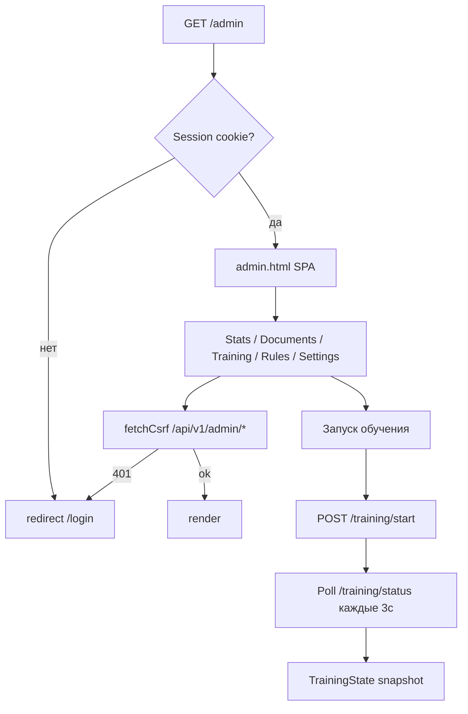

# Design: Admin UI (F11)

> Requirements: @requirements.md
> Status: Approved

## 1. Summary

Admin-подсистема: FastAPI-роутер `/api/v1/admin/*` (+ `/api/v1/rules`), сервисные модули `admin/stats.py` и `admin/training.py`, auth-стек (`auth/`) с сессионными cookies + CSRF, vanilla-JS SPA `frontend/admin.html`/`admin.js`. Всё в одном процессе Uvicorn (P-010).

## 2. Requirements Mapping

| Requirement | Design Coverage |
|-------------|-----------------|
| FR-001 | §3.1 admin/stats.py + GET /stats |
| FR-002 | §3.2 list/detail endpoints |
| FR-003 | §3.3 admin/training.py + endpoints |
| FR-004 | §3.4 api/rules.py |
| FR-005 | §3.5 GET/PUT settings |
| FR-006 | §3.6 auth stack |
| FR-007 | §3.7 admin.html/admin.js + ui.py |
| FR-008 | §3.8 tests |
| NFR-001 | §3.6 (cookies/CSRF), drill-down ограничение |
| NFR-002 | §3.3 (TrainingState lock, 409) |

## 3. Technical Approach

### 3.1 Статистика (`admin/stats.py`)

- `compute_documents_stats(storage_dir, period, since)` → `DocumentStats`:
  - `total`, `completed`, `failed`, `with_feedback`
  - `buckets` — счётчики по `day|week|month`
- `compute_jobs_with_feedback(storage_dir, limit)` → `list[JobFeedbackSummary]`:
  - детект feedback.json в job-dir; агрегируют confirmed/rejected/added
  - `corrections_by_type`, `false_positive_by_type`, `missed_by_type`
- Чистое чтение FS; без БД.

### 3.2 Список и drill-down

- `GET /api/v1/admin/documents?limit=50` → summaries.
- `GET /api/v1/admin/documents/{job_id}` → `{job_id, job, text, annotations, feedback}`; 404 при отсутствии job-dir или job.json.

### 3.3 Дообучение (`admin/training.py`)

```text
start_training_from_feedback(storage_dir, output_dir, opf_cmd, epochs, timeout)
  ├─ lock: if get_training_state().status == "running" -> RuntimeError (→409)
  ├─ build JSONL dataset: training_dataset.jsonl + feedback.json (дедуп)
  ├─ spawn subprocess: opf train <dataset> --epochs N -o output_dir
  └─ TrainingState (idle|running|completed|failed; epoch; loss; eta)
get_training_state() -> TrainingState      # shared singleton snapshot
stop_training() -> bool                    # SIGTERM/terminate subprocess
```

- Идемпотентность: повторный start → 409; stop при idle → OK.
- Статус сериализуется `_serialize_state`.

### 3.4 Правила (`api/rules.py`)

```text
GET   /api/v1/rules             list rules (metadata)
GET   /api/v1/rules/stats       rule statistics
POST  /api/v1/rules/proposals   generate proposals (из feedback-паттернов)
POST  /api/v1/rules/{id}/approve  approve rule
POST  /api/v1/rules/{id}/reject   reject rule
POST  /api/v1/rules             add manual rule
```

- Хранение: `_rules_dir(settings)` — JSON/метаданные правил в storage.
- `_save_rule_meta` — атомарная запись.

### 3.5 Runtime-настройки

- `GET /api/v1/admin/settings` → `{privacy_filter_timeout}` (из Settings + `_load_runtime_timeout`).
- `PUT /api/v1/admin/settings` → валидация, `_save_runtime_timeout` в storage; применяется на лету.

### 3.6 Auth-стек (`auth/`)

```text
api/auth.py:
  GET  /login (form page)
  POST /login  → verify NEIRONIR_ADMIN_USER/PASSWORD from settings → set cookies
  POST /logout → clear cookies
  GET  /api/v1/auth/whoami → current user (401 if none)
auth/session.py: подпись/проверка session cookie (itsdangerous)
auth/csrf.py:   CSRF-токен generation/validation
auth/middleware.py, max_body_size.py: origin checks, лимит тела
api/dependencies.py: require_admin_auth, verify_csrf
```

- Все admin/rules роутеры объявляют `dependencies=[Depends(require_admin_auth), Depends(verify_csrf)]`.
- Cookie: HttpOnly + SameSite + Secure при `_is_secure(request)`.

### 3.7 Frontend

- `ui.py`: `GET /` → index.html; `GET /admin` → admin.html (оба FileResponse).
- `admin.html`: секции Stats / Settings / Training / Documents / Rules / Logout.
- `admin.js`: `fetchCsrf(url, opts)` — добавляет CSRF, при 401 → `/login?next=…`; polling `training/status` каждые ~3с; CRUD правил; settings.

### 3.8 Тесты

- unit: `tests/unit/admin/` (stats, training, append_feedback_to_dataset), `tests/unit/auth/` (csrf, session).
- integration: `tests/integration/test_admin_api.py` (stats, documents, training 409, admin-UI served), `tests/integration/test_auth_api.py` (login/logout/whoami, endpoints require auth).

## 4. Component / Module Structure

```text
backend/neironir/
  admin/
    router.py       # /api/v1/admin/* endpoints
    stats.py        # compute_documents_stats, compute_jobs_with_feedback
    training.py     # TrainingState, start/stop training subprocess
  api/
    auth.py         # /login, /logout, /api/v1/auth/whoami
    rules.py        # /api/v1/rules
    ui.py           # GET / , GET /admin
    dependencies.py # require_admin_auth, verify_csrf, get_settings
  auth/
    session.py, csrf.py, middleware.py, max_body_size.py
frontend/
  admin.html, admin.js
tests/unit/admin/, tests/unit/auth/
tests/integration/test_admin_api.py, test_auth_api.py
```

## 5. Data Model / State

- `TrainingState` — in-process singleton; не персистится.
- Правила — JSON в `storage/rules/` (через `_rules_dir`).
- Runtime timeout — JSON в storage (`_save_runtime_timeout`).
- Данные для обучения — `storage/checkpoints/training_dataset.jsonl` + job-`feedback.json`.

## 6. API / Integration Contract

Все под `/api/v1/admin/*` (кроме `/api/v1/rules`). Требуют session + CSRF. Описано в §3.1–§3.6.

## 7. Security / Permissions / Privacy

- Admin auth: cookies HttpOnly/SameSite, Secure в prod; CSRF для unsafe.
- `NEIRONIR_ADMIN_PASSWORD` — из env; не логируется.
- Списки документов: только сводки (без PII-текста). Drill-down — осознанное исключение (D-004).
- Max body size middleware защищает от больших payload.

## 8. User Flows



## 9. Edge Cases

| Case | Expected |
|------|----------|
| Нет feedback вообще | stats: нули; training/start → 422/409 c понятной ошибкой (test_start_marks_failed_when_no_feedback) |
| Обучение уже идёт | 409 training_in_progress |
| Stop при idle | OK, signal_sent=false |
| Нет session | 401 → redirect /login |
| CSRF mismatch | 403 |
| Job не существует | 404 |
| Невалидный period/days | 422 |

## 10. Accessibility / UX Notes

- Лейблы, hint-тексты, disabled-состояния кнопок (train-stop disabled когда idle).
- Сообщения об ошибках рядом с действиями (settings-status, training-status).

## 11. Observability / Operations

- Логирование через `logging`; `logger.exception` на ошибках старта обучения.
- Нет метрик (вне MVP).

## 12. Migration / Rollout

- Без миграций. Auth-параметры — env (`NEIRONIR_ADMIN_USER`, `NEIRONIR_ADMIN_PASSWORD`).

## 13. Technical Decisions

### TD-001: Собственная сессионная auth (itsdangerous)
- **Decision:** signed session cookie (itsdangerous) + CSRF; без внешнего auth-провайдера.
- **Why:** zero extra deps (itsdangerous уже в deps); достаточно для одного оператора; безопаснее basic-auth.
- **Trade-off:** нет refresh-токенов, мультисессии — вне MVP.

### TD-002: TrainingState singleton + subprocess
- **Decision:** общий in-process снапшот; `opf train` как subprocess.
- **Why:** polling UI; изоляция падений; никакого in-process ML API.
- **Trade-off:** состояние теряется при рестарте сервера.

### TD-003: Правила как JSON в storage
- **Decision:** `api/rules.py` + `_rules_dir`; atomic_write.
- **Why:** простота, без БД.
- **Trade-off:** нет версионирования/аудита на уровне БД (audit — через сам факт approve/reject и файлы).

## 14. Risks

| Risk | Impact | Mitigation |
|------|--------|------------|
| Секрет admin в env | High | .env в .gitignore; не логировать |
| CSRF на unsafe-методах | High | verify_csrf на всех unsafe; тесты |
| Training subprocess завис | Medium | timeout из settings; stop endpoint; обработка сигналов |
| PII в drill-down | Medium | Доступ только admin (auth); списки без текста |

## 15. Verification Strategy

- unit: `pytest tests/unit/admin/ tests/unit/auth/`
- integration: `pytest tests/integration/test_admin_api.py tests/integration/test_auth_api.py`
- полный: `make test` / `make test-real`

## 16. Implementation FAQ

**Q:** Почему не basic-auth?  
**A:** D-001: cookies+CSRF безопаснее и дают logout; basic-auth оставил бы логин в браузерном менеджере без контроля истечения.

**Q:** Что видит админ в списке документов?  
**A:** Только сводки (D-004): счётчики подтверждённых/отклонённых/добавленных правок, распределения по типам. Полный текст — только в drill-down по конкретному job.

**Q:** Как UI защищён от 401?  
**A:** `fetchCsrf` в admin.js редиректит на `/login?next=…` при 401.

**Q:** Можно ли запустить обучение без feedback?  
**A:** Эндпоинт вернёт ошибку (422/409) — тест `test_start_marks_failed_when_no_feedback`.
